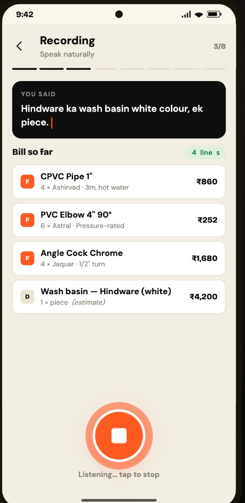
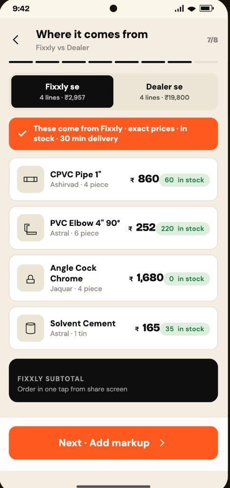
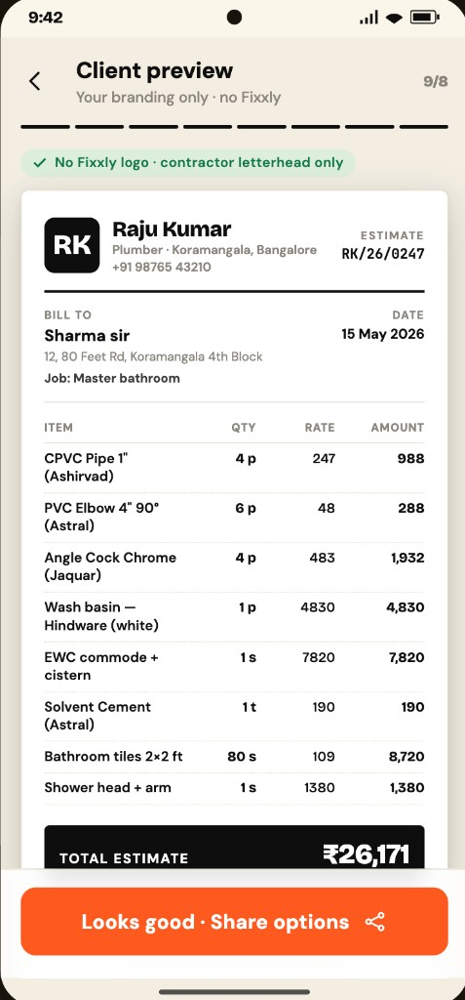

# Fixxly — Part 1: Retention Diagnosis & Product Response

**Pankaj Khannade · Head of Product Assignment**  
**May 2026**

---

## Executive summary

**The number:** 40% of Week-1 contractors do not place a second order within 14 days.

**Diagnosis:** Fixxly wins the **urgent first order**; it loses **order 2 and beyond** because the **hardware dealer** still owns how contractors run the **next job** — especially the **client material quote** — and the current app is a **catalogue**, not a **business tool**.

**Proposed response:** **Bill Banayein** — the contractor voices or templates a full client bill in approximately 3 minutes, sees an honest **Fixxly vs dealer split**, adds markup, shares a **white-label PDF** (the client never sees Fixxly), then places **Order Fixxly lines** in one tap.

**30-day success (1-store pilot):** ≥1.5 bills/contractor/week · ≥45% bills → Fixxly order · ≥50% bills shared with client.

---

## 1. Operating context

```
  TODAY                              TARGET (90 days)
  ─────                              ────────────────
  3 dark stores                      Same footprint
  ~60 OPD / store                    150 OPD / store
  App = browse → cart → order        App + job-start workflow
  60% Week-2 retention               Move the addressable half
```

| Assumption | Implication |
|------------|-------------|
| Urban plumber / mistri, Bangalore | Voice + bilingual UI; not consumer e-commerce UX |
| Client often pays for materials | Contractor is **procurement agent** — quote matters |
| Many jobs = **new site daily** | "Reorder last basket" is the wrong hero feature |
| Fixxly wedge = **30 min**, not SKU count | Honest partial fulfilment beats pretending full catalogue |
| **30-min delivery radius ~10–15 km** per dark store | Catchment holds **~2k–8k** active material buyers/month; Fixxly touches **~200** at 60 OPD (see **Appendix A** and Part 3) |

### Appendix A — Scale at 60 OPD (operating context)

*Full unit-economics build in Part 3. Summary here for retention framing.*

| Input | Assumption | Calculation |
|-------|------------|-------------|
| Delivery radius | **10–15 km** (~**12 km** mid) | 30-min constraint in Bangalore traffic |
| Catchment area | π × 12² ≈ **450 km²** | One store blob; **3 stores overlap** |
| Active material buyers in catchment / month | **~2,000–8,000** | ~15–25% of Bangalore trade SAM per store (market appendix) |
| Orders / store / month | 60 × 30 = **1,800** | Assignment OPD |
| Daily unique orderers | 60 ÷ **1.3** ≈ **46** | ~1.3 orders per contractor on active days |
| **MAC / store / month** | **~200** (range 180–220) | 46 daily × **~4.3** overlap factor ≈ 200 unique/month |
| **Orders / MAC / month** | 1,800 ÷ 200 = **9** | ~2 orders/week per active contractor |
| Fixxly penetration of catchment | 200 ÷ 5,000 ≈ **4%** | Mid catchment ÷ mid MAC — early stage, credible |

**Identity check:** MAC × orders/MAC = monthly orders → **200 × 9 = 1,800** ✓ (= 60 OPD × 30)

---

## 2. Diagnosis — why 40% do not reorder

Not all non-repeat is churn. Three buckets:

```
                    40% no 2nd order in 14 days
                              │
          ┌───────────────────┼───────────────────┐
          ▼                   ▼                   ▼
    WOULD NOT             CANNOT            DID NOT NEED
   chose dealer         tried app,          no material
   instead             could not finish      buy in window
```

### Five reasons — ranked by conviction

| Rank | Reason | Conviction | Summary |
|:----:|--------|:----------:|---------|
| **1** | **Next run goes to hardware dealer** | High | Order 1 = urgent trial on Fixxly. Order 2 = new list → dealer wins on WhatsApp, credit, spec, one message. |
| **2** | **14-day metric mixes job types** | Medium | Daily-site contractors appear churned at D14 even when still active. Segment before reacting. |
| **3** | **App is a shop, not job workflow** | High | No client **hisaab** at job start. Dealer owns *"material kitna lagega?"* |
| **4** | **Next basket not stocked / findable** | Medium | Silent search exit — looks like disinterest; is assortment gap. |
| **5** | **Tail: bad delivery, noise, no need** | Low | Real but requires OTIF + cohort data. Not the primary lever. |

**Primary addressable gap:** **#1 + #3** — dealer habit at **job start**, not checkout.

**Lower priority at launch:** Discount coupons, "reorder last order" as hero, or renovation-only phase kits for a daily-job base.

### Today vs tomorrow — where Fixxly loses

```
  JOB START (7:45 AM, new site)
  ─────────────────────────────
  Client: "Material kitna lagega?"
           │
           ▼
  ┌─────────────────┐         ┌─────────────────┐
  │ TODAY           │         │ WITH BILL       │
  │ Contractor →    │         │ BANAYEIN        │
  │ Dealer WhatsApp │         │ Contractor →    │
  │ (full list +    │         │ Fixxly app      │
  │  price + udhaar)│         │ (full bill +    │
  └────────┬────────┘         │  split + share) │
           │                  └────────┬────────┘
           │                           │
           ▼                           ▼
  Dealer supplies all          Fixxly lines (30 min)
                               + dealer list (rest)

  ORDER 1 URGENT (workers waiting)
  ────────────────────────────────
  Fixxly WINS ✓  — speed trial
  ORDER 2+ NEW LIST
  Fixxly LOSES ✗  — dealer owns workflow
```

---

## 3. Product response — Bill Banayein

### One-line summary

> **Contractor creates a client material bill in 3 minutes — voice or template — sees Fixxly vs dealer split, adds markup, shares PDF. Customer never sees Fixxly.**

### What changes for the contractor

| Today | With Bill Banayein |
|-------|-------------------|
| Search SKUs one by one | Speak or pick job template |
| Fixxly = partial catalogue | **Full job bill** with honest split |
| Client quote = dealer responsibility | **Contractor-branded PDF** |
| Order 2 = forgotten app | Every **new job starts in Fixxly** |

### End-to-end flow

```
  HOME (browse / cart / order stay as today)
       │
       └──► Bill Banayein  ◄── not default path; retention wedge
                 │
       ┌─────────┴─────────┐
       ▼                   ▼
   Template            Voice (+ sample
   (job type)          "aisa bolein")
       │                   │
       └─────────┬─────────┘
                 ▼
         Edit bill (qty, lines)
                 ▼
         AI price + SPLIT
    ┌────────────┴────────────┐
    ▼                         ▼
 FIXXLY (green)            DEALER (grey)
 exact · 30 min           estimate · local
    │                         │
    └────────────┬────────────┘
                 ▼
         Markup (required)
                 ▼
    Client PDF (contractor brand ONLY)
                 │
       ┌─────────┼─────────┐
       ▼         ▼         ▼
   WhatsApp   Order      Dealer
   to client  Fixxly     list (no rates)
```

### Who sees what

| Audience | Sees | Never sees |
|----------|------|------------|
| **Client** | Contractor PDF, sell prices | Fixxly, cost, dealer split |
| **Contractor** | Full bill, margin ₹, Fixxly/dealer tags | — |
| **Dealer (WhatsApp)** | Site, spec, qty | Prices |

---

## 4. What the AI does (and does not do)

**Not a chatbot.** AI orchestrates **bill assembly → pricing → split → PDF**.

```
  Voice or template
        │
        ▼
  ┌─────────────┐
  │ 1. PARSE    │  STT + NLU → materials, qty, brand
  └──────┬──────┘  (live update every ~2–3 sec)
         ▼
  ┌─────────────┐
  │ 2. MATCH    │  Retrieval → master catalogue (Kn/En/trade aliases)
  └──────┬──────┘  No invented SKUs
         ▼
  ┌─────────────┐
  │ 3. PRICE    │  Fixxly live | reference median | web fetch (estimate)
  └──────┬──────┘
         ▼
  ┌─────────────┐
  │ 4. SPLIT    │  Hard rule: in-stock @ dark store = Fixxly
  └──────┬──────┘  LLM cannot override inventory
         ▼
  ┌─────────────┐
  │ 5. OUTPUT   │  Markup + white-label PDF + dealer payload
  └─────────────┘
```

### Data required

| Data | Use | At launch |
|------|-----|:---------:|
| Order history | Templates, frequent lines | ✓ |
| Fixxly SKU + inventory | Split + one-click order | ✓ |
| Contractor profile | PDF letterhead, language, markup default | ✓ |
| Reference master (extended) | Price lines Fixxly does not stock | ✓ pilot |
| Site list | Reuse delivery addresses | Nice-to-have |

### Model approach — hybrid

| Step | Approach | Rationale |
|------|----------|-----------|
| Voice → lines | Streaming STT + constrained NLU | Live bill; Kannada + English |
| Job → template | **Rules** | Auditable BOM seeds |
| Line → SKU | **Retrieval** | No hallucinated products |
| Reference price | Crawl + median + rules | Tag **estimate**; contractor confirms |
| Fixxly split | **Hard inventory rule** | Trust — OOS never shown as Fixxly |
| Client PDF | **Templates** | Cheap, consistent, white-label |
| Markup | **Rules + UI** | Business-critical; not LLM |

**Why not pure LLM:** Wrong SKU or price → contractor loses credibility with client.  
**Why not pure rules:** Trade speech is messy; voice requires NLU.

---

## 5. Success at 30 days (1-store pilot)

| Metric | Target | Rationale |
|--------|--------|-----------|
| Bills / active contractor / week | **≥ 1.5** | Proves job-start habit (vs ~0.3 browse-only) |
| Bill → Fixxly order (7d) | **≥ 45%** | Revenue, not PDF alone |
| Bill → client share | **≥ 50%** | Proves real client workflow |
| Orders / contractor / week | **+30%** vs holdout | Moves OPD toward 150 |
| **Baseline orders / MAC / month** | **~9** today | 60 OPD × 30 ÷ ~200 MAC (Appendix A) |
| Time to shareable PDF | **< 5 min** median | On-site usable at 7:45 AM |
| Pricing disputes | **< 8%** | Trust gate |

**Rollout:** W1 template + split + PDF · W2 voice + live bill · W3 reference pricing · W4 metrics.

---

## 6. UX — three screens (assignment cap)

**Persona:** Raju Kumar, plumber, 10th pass, on-site 7:45 AM, dusty hands, Kannada + English.

**Principles:** One primary action per screen · voice before typing · numbers over paragraphs · client never sees Fixxly.

**Entry (not counted):** Home → **Bill Banayein** tile — *"Client estimate in 3 minutes — just speak it"*

### Screen journey

```
  SCREEN 1              SCREEN 2              SCREEN 3
  Bol ke banao          Hisaab + split        Client ko bhejo
  ────────────          ──────────────        ───────────────
  Voice + live bill     Fixxly │ Dealer       PDF preview
  Template fallback     Stock + estimate      Contractor brand
                        30 min delivery       Share → order
```

*High-fidelity mocks below. Full flow has 8 steps; these three meet the assignment cap.*

---

### Screen 1 — Bol ke banao *(Speak and build)*

**Purpose:** Start the bill without searching the catalogue.



**Key elements:**
- Contractor speaks in Hindi/English mix — *"Hindware ka wash basin… ek piece"*
- **Bill so far** updates live (4 lines) while recording — instant feedback at 7:45 AM
- Fixxly lines (F) vs dealer lines (D) tagged early; wash basin marked **(estimate)**

---

### Screen 2 — Hisaab + split *(Fixxly vs dealer)*

**Purpose:** Trust the numbers; see exactly what Fixxly can deliver in 30 min.



**Key elements:**
- **Fixxly se** — 4 lines · exact prices · in-stock counts · 30 min delivery
- **Dealer se** — remaining lines · reference **estimate** (e.g. ₹19,800 for 4 lines)
- Honest split — no pretence that the dark store stocks everything

*Next in flow: markup (mandatory) → client preview.*

---

### Screen 3 — Client ko bhejo *(Share under contractor brand)*

**Purpose:** Share a professional estimate with the client — **no Fixxly branding**.



**Key elements:**
- **Raju Kumar, Plumber** letterhead only — green banner: *No Fixxly logo*
- Client sees **sell prices** and **TOTAL ESTIMATE** — not cost, not dealer split
- Branded estimate ID (ESTIMATE RK/26/0247) — contractor presents professionally on site

*After this screen: Share PDF on WhatsApp → one-tap Order Fixxly parts → dealer list (no rates).*

---

## 7. Week 1 validation plan

| Question | Method |
|----------|--------|
| Where did order 2 materials come from? | 15 contractor interviews |
| Opened app but did not order vs never reopened? | Funnel / event data |
| When does client hear material number? | Shadow 10 jobs on site |
| D14 vs D21/D30 by job type? | Cohort segmentation |
| Search → zero result → exit? | Search log analysis |

---

## 8. Risks and mitigations

| Risk | Mitigation |
|------|------------|
| Dealer still receives full shopping list | Accept at launch; **order Fixxly first** in UX; tackle credit later |
| Wrong reference price | **Estimate** label + contractor confirmation before share |
| Voice fails on noisy site | Template always visible; every line editable |
| Customer sees Fixxly | White-label PDF only; QA checklist |

---

## Conclusion

**Bill Banayein puts Fixxly at the start of every job — full client hisaab, honest Fixxly vs dealer split, contractor keeps the margin — so order 2 is natural, not a forgotten reorder button.**

---
